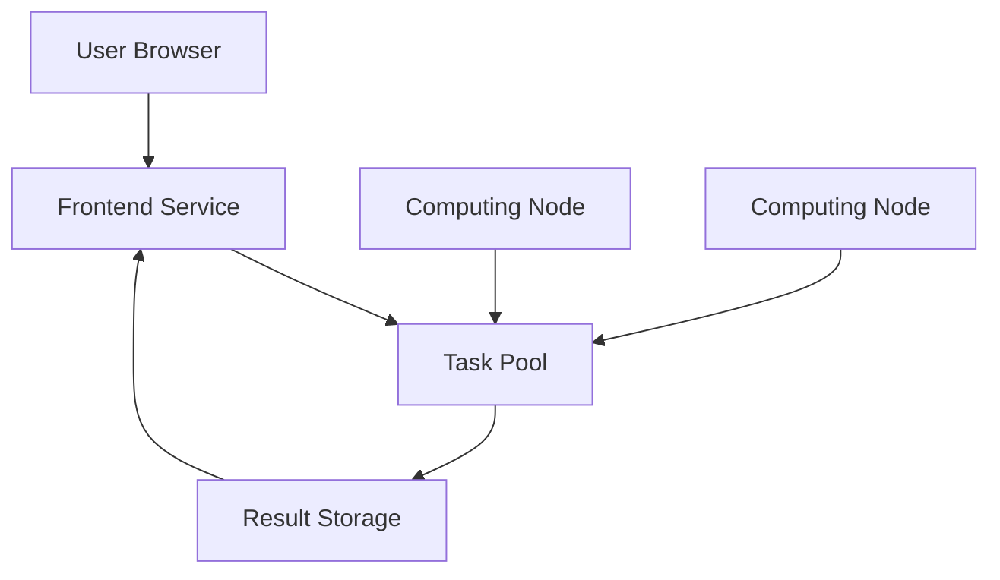

# A decentralized AI paper analysis tool

### Supported by [$scihub community](https://t.me/WTFDeSci) and [@sporedotfun](https://x.com/sporedotfun)

## Tips

The project is still under development, and nodes will be online in the coming weeks.

## Overview

Sci16z is a decentralized platform that makes scientific research accessible to everyone. We not only analyze academic papers but also transform complex research into engaging, easy-to-understand content for the general public. By joining our network, you can earn tokens while helping bridge the gap between cutting-edge research and everyday life.

## Key Features

- 🔍 **AI-Powered Analysis**
  - Automatic paper summarization
  - Key findings extraction
  - Fast cross-language translation
  - Science popularization for general readers
  - Real-world impact explanations
  - Visual explanations of complex concepts
  - Interactive learning experiences

- 🌟 **Science for Everyone**
  - Plain language explanations
  - Real-life applications showcase
  - Interactive visualizations
  - "Why This Matters" sections
  - Connection to daily life
  - Future impact predictions

- 💰 **Token Economics**
  - Earn tokens by sharing computing power
  - Reward distribution based on contribution
  - Extra rewards for quality science communication
  - Incentives for creating educational content

- 🌐 **Decentralized Network**
  - Distributed computing architecture
  - Peer-to-peer paper sharing
  - Community-driven development
  - Collaborative science education
  - Public engagement initiatives

- 🛠 **Easy Setup**
  - One-click node installation
  - Browser-based interface
  - No technical expertise required
  - Beginner-friendly content creation tools

## Quick Start

1. Install Node.js (v16 or later)
```bash
npm install
npm run dev
```

2. Configure environment variables
```bash
cp .env.example .env.local
```

3. Download and run a node
```bash
# Download the installer
wget https://sci16z.com/downloads/installer.sh

# Run the installer
bash installer.sh
```

## Architecture



## Development

### Prerequisites
- Node.js v16+
- Python 3.8+
- CUDA 11.7+ (for GPU support)

### Local Development
```bash
# Install dependencies
npm install

# Start development server
npm run dev

# Run tests
npm test
```

### Production Deployment
```bash
# Build frontend
npm run build

# Start production server
npm start
```

## Contributing

We welcome contributions! Please see our [Contributing Guidelines](CONTRIBUTING.md) for details.

1. Fork the repository
2. Create your feature branch
3. Commit your changes
4. Push to the branch
5. Create a Pull Request

## Community


- Twitter: [@sci16z](https://x.com/sci16z)
- Discord: coming soon
- Telegram: coming soon

## License

This project is licensed under the MIT License - see the [LICENSE](LICENSE) file for details.

## Acknowledgments

- $scihub community for their support
- All contributors and node operators
- The open-source community

## Security

For security concerns, please email security@sci16z.com

## Roadmap

- [x] Basic paper analysis
- [x] Token distribution system
- [x] Science popularization framework
- [ ] Interactive learning platform
- [ ] "Science in Daily Life" section
- [ ] Community education program
- [ ] Multi-language science communication
- [ ] Public engagement dashboard
- [ ] Science impact tracking system
- [ ] Collaborative research explanation tools
- [ ] Enhanced AI models for content simplification
- [ ] Cross-chain integration for wider accessibility

## Impact Goals

Our mission is to democratize scientific knowledge:

- 📚 **Breaking Down Barriers**
  - Transform complex research into accessible content
  - Bridge the gap between academia and public understanding
  - Make scientific discoveries relevant to everyday life

- 🌍 **Global Science Education**
  - Reach diverse audiences worldwide
  - Promote scientific literacy
  - Inspire the next generation of scientists

- 🤝 **Community Engagement**
  - Foster public discussion of scientific advances
  - Connect researchers with the general public
  - Build a more scientifically informed society

- 🚀 **Future Impact**
  - Help people understand how research affects their lives
  - Enable informed decision-making
  - Accelerate the adoption of scientific innovations

---

<p align="center">Made with ❤️ by the Sci16z community</p>