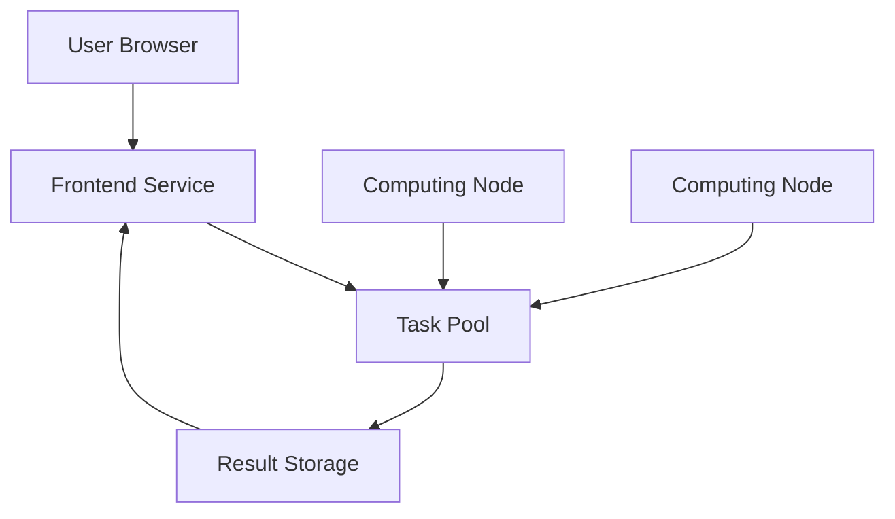

# A decentralized AI paper analysis tool

### Supported by $scihub community and [@sporedotfun](https://x.com/sporedotfun)


## Overview

Sci16z is a decentralized platform that leverages community computing power to analyze academic papers. By joining our network, users can earn tokens while contributing to scientific research accessibility.

## Key Features

- 🔍 **AI-Powered Analysis**
  - Automatic paper summarization
  - Key findings extraction
  - Fast cross-language translation
  - Citation network analysis

- 💰 **Token Economics**
  - Earn tokens by sharing computing power
  - Reward distribution based on contribution
  - Community governance system

- 🌐 **Decentralized Network**
  - Distributed computing architecture
  - Peer-to-peer paper sharing
  - Community-driven development

- 🛠 **Easy Setup**
  - One-click node installation
  - Browser-based interface
  - No technical expertise required

## Quick Start

1. Install Node.js (v16 or later)
```bash
npm install
npm run dev
```

2. Configure environment variables
```bash
cp .env.example .env.local
```

3. Download and run a node
```bash
# Download the installer
wget https://sci16z.com/downloads/installer.sh

# Run the installer
bash installer.sh
```

## Architecture



## Development

### Prerequisites
- Node.js v16+
- Python 3.8+
- CUDA 11.7+ (for GPU support)

### Local Development
```bash
# Install dependencies
npm install

# Start development server
npm run dev

# Run tests
npm test
```

### Production Deployment
```bash
# Build frontend
npm run build

# Start production server
npm start
```

## Contributing

We welcome contributions! Please see our [Contributing Guidelines](CONTRIBUTING.md) for details.

1. Fork the repository
2. Create your feature branch
3. Commit your changes
4. Push to the branch
5. Create a Pull Request

## Community

- Twitter: [@sporedotfun](https://x.com/sporedotfun)
- Discord: [Join our server](https://discord.gg/sci16z)
- Telegram: [Join our group](https://t.me/sci16z)

## License

This project is licensed under the MIT License - see the [LICENSE](LICENSE) file for details.

## Acknowledgments

- $scihub community for their support
- All contributors and node operators
- The open-source community

## Security

For security concerns, please email security@sci16z.com

## Roadmap

- [x] Basic paper analysis
- [x] Token distribution system
- [ ] Enhanced AI models
- [ ] Mobile app support
- [ ] Cross-chain integration
- [ ] DAO governance

---

<p align="center">Made with ❤️ by the Sci16z community</p>